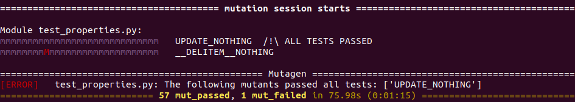
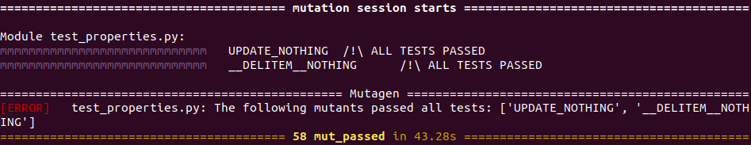
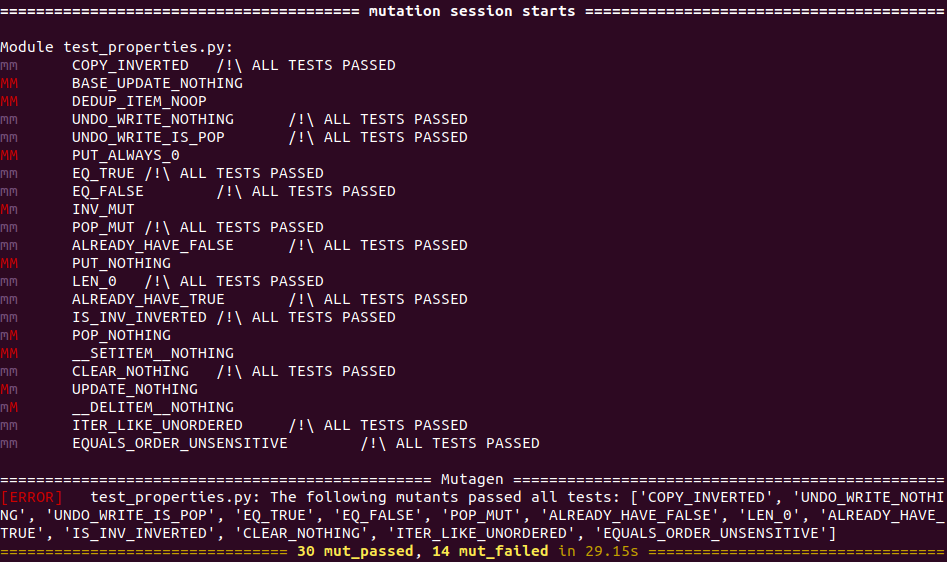

This post introduces [mutagen](https://pypi.org/project/pytest-mutagen/), a plugin to
[pytest](https://pypi.org/project/pytest/) that provides easy-to-use tools for *mutation testing*.
We are still actively working on the plugin and figuring out what features it needs---if you would
like to get in on the ground floor and have a say in the features that we build, get in touch! We
can help you get started with the library and provide advice for how best to use mutation testing in
your project. Open an issue on [GitHub](https://github.com/hgoldstein95/pytest-mutagen) or send us
an email.

----------

## Mutation Testing

Testing is hard. Sometimes no matter how much time and effort you put in, bugs still slip through
the cracks. While this will always be true, there are actually ways of *testing your tests* to
better understand how well they can find bugs in your code.

*Mutation testing* is a technique that involves intentionally breaking, or *mutating*, pieces of
code. The tester runs the test suite on the mutated code, with the hope that the tests catch any
bugs that were introduced by the mutation. For example, given the code below
```python
def deduct_balance(acc, x):
  if acc.balance < x:
    return 0
  acc.balance = acc.balance - x
```
a tester might create one mutant where the balance check is inverted
```python
def deduct_balance_m1(acc, x):
  if acc.balance > x:
    return 0
  acc.balance = acc.balance - x
```
and another with an off-by-one-error
```python
def deduct_balance_m2(acc, x):
  if acc.balance < x:
    return 0
  acc.balance = acc.balance - x + 1
```
and verify that the tests for `deduct_balance` _fail_ when run with these incorrect implementations.

The (plausible) assumption here is that a test suite that catches intentionally injected bugs is
more likely to also catch accidental bugs that may be lurking in the code -- especially if the test
suite _quickly_ catches bugs due to a _variety_ of mutants.

## Introducing Mutagen

In the rest of this post, we give an example showing how to add mutants to an existing project; in
this case, we focus on adding mutants to a popular open source library called
[bidict](https://github.com/jab/bidict), using a plugin that we have written for `pytest` called
*mutagen*. Bidict introduces a bidirectional mapping data structure, which is used as a dictionary
that can be reversed.

The `pytest-mutagen` package provides two separate ways to introduce mutations into code:

- Declare a mutation inline, using `mut` function. For the example above, we might modify the
  `deduct_balance` function itself to look like this:
  ```python
  def deduct_balance(acc, x):
    if mut("FLIP_LT", lambda: acc.balance < x, lambda: acc_balance > x):
      return 0
    acc.balance = acc.balance - 1
  ```
  This would create the same mutant as `deduct_balance_m1` above, assigning it the name "`FLIP_LT`".
  Since `mut` is a plain python function but we don't want both arguments evaluated all of the time,
  we wrap both branches in "thunks".

- Replace a whole function with another one, using the `@mutant_of` decorator. Again for the
  `deduct_balance` example, we might define a mutant "`ADD_ONE`" that injects the off-by-one error
  from `deduct_balance_m2`:
  ```python
  @mutant_of("deduct_balance", "ADD_ONE")
  def deduct_balance_m2(acc, x):
    if acc.balance < x:
      return 0
    acc.balance = acc.balance - x + 1
  ```

You can find complete documentation in the README file of our
[GitHub repository](https://github.com/hgoldstein95/pytest-mutagen).

Next we will step through the process of adding mutation tests to a codebase. These examples have
been modified a bit for readability, but they are real examples pulled from a real open-source
project.

### Step 1: Try simple mutations.

Our overall goal is to find mutations of the source code that are not detected by the tests: if we
find one, this means that the test suite has some kind of gap that can be filled with new tests. For
this purpose, let's mutate some functions in the simplest way possible: replace them with a `pass`
statement.[^impractical] Here the expected behaviors of `update` and `__delitem__` are respectively
to update the dict with new (key, value) couples and to delete an item, but we replace them with
`pass`.

```python
import pytest_mutagen as mg
from bidict._mut import MutableBidict # We have to import the class that we are going to mutate from the file bidict/_mut.py

mg.link_to_file("test_properties.py") # Specify the test file that will be run when applying the mutants

@mg.mutant_of("MutableBidict.update", "UPDATE_NOTHING")
def update_nothing(self, *args, **kw):
    pass

@mg.mutant_of("MutableBidict.__delitem__", "__DELITEM__NOTHING")
def __delitem__nothing(self, key):
    pass

```

[^impractical]: Sometimes this will cause everything to break because the function is supposed to
    return something---in that case, rather than `pass` we might choose `return None`, `return 0`,
    etc.

Then we can run the mutations with
```sh
python3 -m pytest --mutate -q test_properties.py MutableBidict_mutations.py
```
and see whether or not the test suite catches them.



We can see in this picture that mutagen ran the 29 tests for each mutant, `UPDATE_NOTHING` and
`__DELITEM__NOTHING`. In the top half of this picture, the outcome of each test is represented by
one letter. A capital red `M` means that the test failed and a lowercase purple `m` means that the
test passed. Therefore `UPDATE_NOTHING` is relevant because no test spotted it and similarly
`__DELITEM__NOTHING` only made one test fail.

### Step 2: Focus on interesting mutants and try to make them more robust.

When a mutant is detected by one or two tests we can then find out why they fail and try to make the
mutant more subtle so the bugs that it introduces are no longer caught. For example in the case of
`__DELITEM__NOTHING`, we understand that the only failing test function expects an exception when
the item is not in the dict. Therefore if we replace the `__delitem__` function with a function that
does nothing if the key exists and else raises a KeyError it passes all tests, even though it's far
from its expected functioning :

```python
@mg.mutant_of("MutableBidict.__delitem__", "__DELITEM__NOTHING")
def __delitem__nothing(self, key):
    if self.__getitem__(key):
        return
    raise KeyError
```



We now have two undetected mutants!  This means we need more tests.

### Step 3: Add new tests to fill the holes.

The final step is to create new tests that catch the mutants. This is not as easy as it might seem,
because simply writing a very specific test that catches at one particular mutant is unlikely to
make our test suite more robust. Instead, we need to fundamentally understand what holes in the test
suite these mutants have unveiled and try to fill them in the most general way possible. Ideally,
the tests that are added should fit with the other ones and be able to detect other mutants. For
`bidict` we added two correctness tests, and voila, now all the mutants are caught:

```python
# Slightly simplified version of both properties, for readability reasons
@given(st.MUTABLE_BIDICTS, st.PAIRS)
def test_update_correct(mb, pair):
    key, value = pair

    mb.update([pair])
    assert mb[key] == value

@given(st.MUTABLE_BIDICTS)
def test_del_correct(mb):
    rand_key = choice(list(mb.keys()))

    del mb[rand_key]
    assert not rand_key in mb
```


We can then run other mutants to check whether the properties we've added actually catch some of
them:



Therefore even some simple correctness properties can catch several mutants and belong to the test
suite!

### On property-based testing and coverage

As you may have noticed we occured to refer to test functions as *properties*. In fact mutation 
testing is particularly adapted to *property-based testing* (PBT), although it works perfectly with 
unit tests. The idea behind PBT is pretty simple : verifying properties or invariants instead of 
particular cases. The previous bidict example provides two examples of properties, one of them is 
that a key that you just deleted should not be in the dictionary. In Python this is possible with 
the help of the Hypothesis library that introduces generators for a lot of different data types and 
will run each test function many times to validate the property.  

One of the problem of property-based testing is the measure of coverage : to what extent do our 
properties cover the functioning of each part of the code ? There exists several code coverage 
measures : function coverage, statement coverage, condition coverage and so on. We can see their 
limitations in the previous bidict example : every function is called so there is a 100% function 
coverage but no test actually checks whether `__delitem__` has deleted the item or not.  

Accordingly, mutation testing can be seen as an additional coverage measure. Indeed, we just 
demonstrated that having a 100% function coverage is mandatory but not sufficient. The manual 
mutation testing that mutagen provides, as opposed to the automated insertion of mutants following 
a set of rules, makes it hard to quantify the coverage with a percentage but can at least point out 
some holes. It's then a more abstract coverage notion, that deals with the expected behavior of the 
code rather than the simple call of it.


## Conclusion

Mutation testing is a powerful tool for testing your tests. By introducing bugs intentionally and
verifying that the test suite catches those bugs, testers can be more confident that their test
suites are robust. [Mutagen](https://pypi.org/project/pytest-mutagen/) offers the first tool we are
aware of for doing this form of mutation testing in Python.

We would like to develop the best tool possible, so we need input from real users. If you have a
project that might benefit from mutation testing, create an issue on our
[GitHub](https://github.com/hgoldstein95/pytest-mutagen) page or send us an email. We will help get
you up and running with mutagen, and we will take your workflow into account when developing
features in the future.
