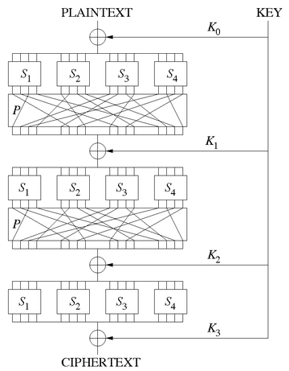
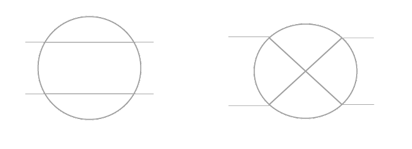
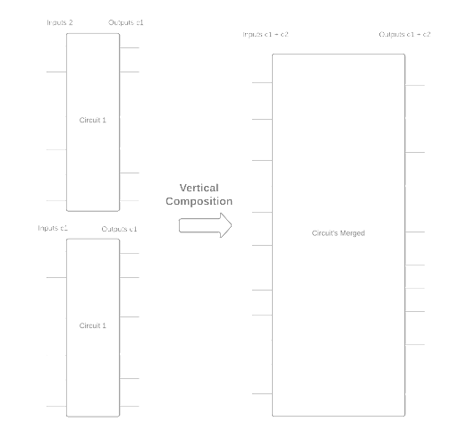
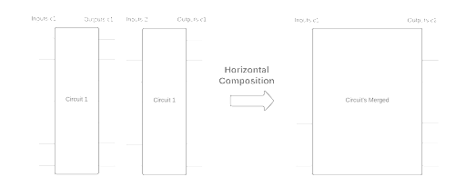
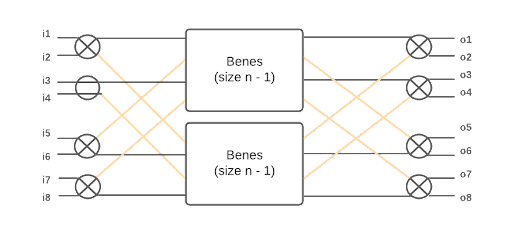

# Introduction

Confidential communication is not only important, but necessary in plenty of scenarios, from online purchases to communicating military intelligence. In order to achieve trust and confidentiality in communications computer scientists invented cryptographic protocols. While the theory behind cryptographic protocols has been rigorously formalized, their implementations are not and prone to bugs. This space is fertile grounds for formal verification of computer programs, which has had success in both academia and industry[1][2].

In this blog post we will formalize a component of many cryptographic protocols, *permutation networks*.
According to World War II historian David Kahn[8], the most common message German intelligence officers would transmit is "Nothing to report".
Even though the passwords to the infamous Enigma machine would change every day, if an American spy intercepted the encrypted message "Abguvat gb ercbeg" he could quickly compare the lengths to the very common "Nothing to report" and infer that "N" encrypts to the letter "A", "o" to "b" etc, soon allowing a spy to decrypt the entire alphabet. Now if the letters in the encrypted message where rearranged (or permuted) in a seemingly random but reversible way, that would prevent this kind of attack known as "known Ciphertext attack", entirely.

Permutation networks do exactly that. Using a network of configurable switches, they rearrange the input, such that their output is always a permutation of the input. They are an important part of the Advanced Encryption Standard (AES)[5] that powers all of web communication technologies.



*Fig0: An algorithm in the AES family with substitutions (S) and permutations (P)*

We will not discuss substitutions here, if only in-passing and as a nod for future work. We will now see some key properties of permutation networks and then proceed in the design and implementation of our formalization.

## Useful properties of permutation networks
Here are some compelling properties of permutation networks.

- They are *configurable*; a network of `n` switches requires `n` configuration bits, which allows the network
to perform `2^n` different permutations.
- They are *reversible*; for all outputs, if we run the network *backwards* we will get the original input.
- They are *scalable*; for inputs of size `n` a poly-logarithmic number of switches are required.
There are many constructions following Benes'[1] original work that improved on that boundary, for example Waksman networks[2], although for all
the switch bound is `O(nlogn)`.
- They are *parametrically polymorphic*; this is a property that is not often discussed in the same breath as permutation networks, but we found to be true. Our construction is parametrized by the type of elements as well as the size
of inputs. Given the right configuration bitvector, a permutation network is finite map `f: forall a n, Vector.t a n -> Vector.t a n`.

# Design
In order to define permutation networks, we first define general configurable circuits and their compositions.

## Circuit framework
We define a general circuit framework in Coq, using dependent records parametrized on the type of inputs, number of inputs and number of outputs.

```coq
Record circuit {a: Type}(inp out: nat) :=
  circ {
	  ns: nat;
	  f : Vector.t bool ns -> Vector.t a inp -> Vector.t a out;
	}.
```

The `ns` attribute stands for number of switches, the configurable binary components that determines how inputs are rearranged. The finite
map `f` represents the denotational semantics of the circuit, given `ns` configuration bits, it then maps inputs to outputs. With this
design we can perform circuit composition easily; by adding the numbers of switches, inputs and outputs accordingly while using
function composition for the extensional behavior of the composed circuit.

Finally, notice how all our circuit constructions are parametric on the type of inputs = type of outputs. This does restrict our constructions and perhaps a more general definition parametrized on both input and output types would be more reusable.

## A binary switch
The fundamental block of our networks is the binary switch. It is a configurable switch with two inputs that map to each other by identity when the switch is configured with a '0' bit or swap places when configured with a '1' bit.



*Fig1: A 1-bit binary switch, left is the switch at the 0 position (identity) and right is the switch at the 1 position (swap). *

Here is the Coq definition that corresponds to the binary switch using the circuit framework above.
```coq
Definition switch {a:Type} :=
  @circ a 2 2 1 (fun c => if hd c then id else (fun v => tl v ++ [hd v])).
```

## Circuit composition

### Vertical
The first composition we define is *vertical composition*.



*Fig2: Vertical circuit composition*

It takes a circuit `c_1` with inputs `i_1` and outputs `o_1`
and a circuit `c_2` with inputs `i_2` and outputs `o_2`, composing them vertically then gives a circuit with inputs
`i_1 + i_2` and outputs `o_1 + o_2`. Here's how we define vertical composition in Coq. Notice the use of `splitat` to
take the first `ns c1` configuration bits and pass them to the first circuit, leaving the rest for the second circuit.

```coq
Definition vertical_compose {a:Type}{i1 i2 o1 o2: nat}
	   (c1: circuit i1 o1)
	   (c2: circuit i2 o2): circuit (i1+i2) (o1+o2) :=
  @circ a (i1+i2) (o1+o2)
	(ns c1 + ns c2)
	(fun bits inps =>
	   let (bs1, bs2) := splitat (ns c1) bits in
	   let (in1, in2) := splitat i1 inps in
	   (f c1) bs1 in1 ++ (f c2) bs2 in2).

Notation "l ^^^ r" := (vertical_compose l r) (at level 40, left associativity).
```

We will be working with exponential-size circuits a lot, so a useful definition is
`twice` which takes a circuit and vertically composes it with itself giving a circuit
with twice the inputs, twice the outputs and twice the number of switches.

```coq
Program Definition twice{a: Type}{i o: nat}(c: @circuit a i o): @circuit a (i*2) (o*2) :=
  c ^^^ c.
Next Obligation. lia. Defined.
Next Obligation. lia. Defined.
```

### Horizontal
We now define horizontal circuit composition; we have two circuits, `c_1` and `c_2`,
and we compose them to one circuit that first applies `c_1` and then to its output applies `c_2`.



*Fig3: Horizontal circuit composition*

Contrary to vertical composition, we must provide a wire mapping of how the outputs of `c_1` map to the inputs of `c_2`. This is
a finite map defined as `WireLayer`.
```coq
Definition WireLayer {a:Type} (n m:nat) := Vector.t a n -> Vector.t a m.
```
This definition is not ideal as it does not exclude, for example, a constant function that ignores the inputs. However, we allow such definitions in the general framework and specialize it when we get to permutation networks. This is our definition for horizontal composition.

```coq
Definition horizontal_compose {a:Type}{i1 i2 o1 o2: nat}
	   (c1: circuit i1 o1)
	   (c2: circuit i2 o2)
	   (wiring : WireLayer o1 i2) : circuit i1 o2 :=
  @circ a i1 o2
	(ns c1 + ns c2)
	   (fun bits inps =>
	  let (bs1, bs2) := splitat (ns c1) bits in
	  (f c2) bs2 (wiring ((f c1) bs1 inps))).

Notation "l >>> r 'using' w" := (horizontal_compose l r w) (at level 40, left associativity).
```

## Permutation specification

For a circuit to be a permutation, first the number of inputs should equal the number of outputs. Second, every input
should appear exactly once in the outputs. A first attempt to formalize permutations is to use the definition of [permutation](https://coq.inria.fr/library/Coq.Sorting.Permutation.html#Permutation) in the Coq standard library, which takes a bit of staring to understand. Here it is reworked for vectors instead of lists [[eponier](https://stackoverflow.com/a/46928711/1364783)].

```coq
Section VPermutation.

  Context {A:Type}.

  Inductive VPermutation: forall n, Vector.t A n -> Vector.t A n -> Prop :=
  | vperm_nil: VPermutation 0 [] []
  | vperm_skip {n} x l l' : VPermutation n l l' -> VPermutation (S n) (x :: l) (x :: l')
  | vperm_swap {n} x y l : VPermutation (S (S n)) (y :: x :: l) (x :: y :: l)
  | vperm_trans {n} l l' l'' :
	  VPermutation n l l' -> VPermutation n l' l'' -> VPermutation n l l''.

End VPermutation.
```

The workhorse of the definition is `vperm_trans` which requires the proof author to non-deterministically provide witnesses of
intermediate rearrangements. However, this non-determinism comes at a cost to automation, as the proof author must provide the witnesses. Consider a weaker definition of permutations instead.

Start with the `range` function that generates a strictly decreasing vector of length `n`.

```coq
Fixpoint range(n:nat) : Vector.t nat n :=
  match n with
  | 0 => []
  | S n => n::(range n)
  end.
```

We can offset ranges by a constant and still get a strictly decreasing range.
```coq
Definition range_offset(off len: nat): Vector.t nat len :=
  map (fun x => off + x) (range len).
```

Now we define a permutation predicate on finite functions, such that for all ranges, applying the function to the range returns
a vector of elements and each one belongs in the original range.

```coq
Definition permutation_of_range {n: nat}(off len:nat)(f : Vector.t nat len -> Vector.t nat n): Prop :=
  forall i, off <= i < off + len -> In i (f (range_offset off len)).

Definition is_permutation{i o: nat}(f: Vector.t nat i -> Vector.t nat o) :=
  permutation_of_range 0 i f.
```

This weaker definition is easier to work with because it simplifies using the `simpl` tactic and does not
require providing intermediate rearrangements, allowing for proof automation. On the other hand, this definition of
permutation is weaker because it does not specify what happens, for example, when values are repeated, which never happens
when using `range`. It would be a good topic for future work to strengthen our proofs, so they use the stronger `VPermutation` predicate.
Notice we do not enforce `i = o` for the finite map here, but later when defining *soundness* and *completeness*, this allows for more liberal types.

## Soundness & Completeness

A permutation network must be correct, both in terms of soundness and completeness.
Soundness meaning; for all the bits of configuration there is a valid permutation of range, meaning one is able to get all `n!` permutations. Completeness meaning; if there is a permutation, then one has all the bits of configuration (number of switches) present. Here are the definitions.

```coq
Definition sound {n m: nat} (c: circuit n m) :=
  n = m /\
  forall bs, is_permutation ((f c) bs).

(* a helper definition for completeness *)
Definition permutation_of_range_vector(off len: nat)(v: Vector.t nat len): Prop :=
  forall i, off <= i < off + len -> In i v.

(* all permutations are possible. *)
Definition complete {n m:nat} (c: circuit n m) :=
  n = m /\
  forall (v:Vector.t nat m), permutation_of_range_vector 0 m v ->
			  exists bs, v = (f c) bs (range n).
```

Notice the helper predicate `permutation_of_range_vector` that works the same as `permutation_of_range`, but applies to vectors instead of finite maps.

#Implementation (Benes network)
There are a few different permutation networks constructions to chose from. We chose a construction by Benes[3], which we found to be both intuitive, scalable and easy to define in a proof assistant.



*Fig4: Benes network recursive definition*

The size of the Benes network is exponential to `n` which we pass as an argument to the construction of the circuit.
The number of inputs = outputs = `2^{S\ n}` where `S\ n` denotes the successor of n.
The number of switches (bits of configuration) is equal to `(2n + 1)2^n`, this one
takes a bit of squinting and perhaps drawing a few Benes networks first.

Notice in fig.4, a Benes network is composed of two sub-circuits, two *mutexes* and two `benes(n-1)`. A mutex is simply a vertical column of `2^n`
switches and `benes(n-1)` is the recursive call to a Benes network with half the inputs and half the outputs. We stack two `benes(n-1)` and end up with three sub-circuits, which are then horizontally composed using a WireLayer we call *cross-wires*.

## The cross-wires WireLayer

Each switch of the leftmost mutex has two outputs, and in order to allot for all possible permutations, there must be exactly one connection to the top `benes(n-1)` sub-network and one connection to the bottom `benes(n-1)` sub-network. What this equates to is each switch having a pathway to both of the networks. To achieve that pair-wise symmetrical mapping, we group adjacent inputs of size `2n` in pairs of twos and get a
matrix `A[2,n]`, then we transpose it to get `A^T[n,2]` and finally concatenate the matrix into a vector of outputs of size `n*2`. This transformation will place adjacent inputs a distance of `n` from each other in the outputs, meaning one input will be on the top `benes(n-1)` and
one in the bottom `benes(n-1)`, as intended. Here is the Coq definition

```coq
Program Fixpoint group{a: Type}{n m: nat}(v: Vector.t a (m*n)): Vector.t (Vector.t a n) m :=
	match m with
	| 0 => []
	| S _ => let (h, ts) := splitat n v in
		  h :: group ts
	end.

(* concat *)
Program Fixpoint ungroup{a: Type}{n m: nat}(v: Vector.t (Vector.t a n) m): Vector.t a (m*n) :=
  match v with
  | [] => []
  | h::ts => h ++ ungroup ts
  end.

Program Definition cross_wires{a: Type}{n m: nat}: @WireLayer a (n*m) (m*n) :=
  ungroup ∘ transpose ∘ group.
```

We omit the definition of transpose here for brevity. Also notice how the dependent types here are an excellent specification to the implementation
provided which simplifies the proofs a lot.

## Benes definition

Putting all of the above together we get the following Coq definition for `benes`.

```coq
Program Fixpoint mutex{a: Type}(n: nat): @circuit a (2*2^n) (2*2^n) :=
  match n with
  | 0 => switch
  | S n' => twice (mutex n')
  end.
Next Obligation. lia. Defined.
Next Obligation. lia. Defined.

Program Fixpoint benes{a: Type}(n: nat): circuit (2*2^n) (2*2^n) :=
  match n with
  | 0 => @switch a
  | S n' =>
	@mutex a n >>>
	   twice (benes n') using @cross_wires a 2 (2^n)
	   >>> @mutex a n using @cross_wires a (2^n) 2
  end.
```

Our goal now, is to show `benes` is both sound and complete by induction on the argument `n`.

# Proofs

It is no surprise that the proof follows the same shape as the construction of `benes`. Since there are two `cross_wires` on the left and right of our stacked `benes(n-1)`, if we show they cancel out and by the recursive step `benes(n-1)` is sound & complete, so should `benes(n)`.

## Cross-wires involutive property lemma
So we start with proving the involutive property of `WireLayer`, we will show that `cross_wires` is involutive.
```coq
Lemma cross_wires_involutive: forall (a: Type) n m v,
	@cross_wires a n m (cross_wires v) = v.
```

To do this, we first unfold `cross_wires` to its definition `ungroup ∘ transpose ∘ group` and we get the following helper lemmas to prove,
which we prove one-by-one, by induction on the length of vector `v`:
(i) group (ungroup v) = v;
(ii) ungroup (group v) = v;
(iii) transpose (transpose v) = v.

## Number of switches lemmas
Since the number of switches of a circuit are opaque in the `circuit` record, we must present equations for `ns` for each circuit.
The culmination of those lemmas is
```coq
Lemma benes_ns: forall {a: Type} n, ns (@benes a n) = (2*n + 1)*2^^n.
```

To see why this is true, proceed by induction on `n`. The Benes network will always have an odd number of columns and each column will have
a length of `2^n` switches.

## Soundness & completeness of `switches` and `benes`

Finally, we can show proofs of soundness and completeness of each individual switch by the following lemmas

```coq
Lemma switch_sound: sound switch.
Lemma switch_complete: complete switch.
```

And then by combining all the above we can show soundness & completeness of Benes networks. Some additional lemmas are required along the way, such
as inclusion lemmas for `mutex` and `cross_wires`, meaning lemmas that show an element on the left of a circuit will be in the right of the circuit as well. Finally, those are the correctness lemmas for our definition of permutation networks.

```coq
Lemma benes_sound: forall n, sound (benes n).
Lemma benes_complete: forall n, complete (benes n).
```

# Evaluation
We have around 600 total lines of Coq definitions. We also have around 400 total lines of proof, a 3:2 ratio of code to proofs.
We attribute the small proof size to using dependent types and our use of Ltac proof automation.

# Discussion & Future work
Our development defined and proved soundness & completeness of Benes networks in the Coq proof assistant. Using a circuit framework abstracts from the specifics of permutation networks, giving us tools to define more circuitry in the future. In addition, by using dependent types and reusable Ltac scripts, we reduced the proof overhead to a compelling ratio. In the future, we would like to suggest two promising directions.

1. A formalization of _substitution networks_, a two-way finite map used in the AES[5] family of algorithms. Together with permutation networks, they should give us the building blocks for specifying and proving AES in Coq.

2. A low-level implementation of AES that is a refinement of this model. The implementation could be through [vellvm](https://www.cis.upenn.edu/~stevez/vellvm/) or [kami](https://plv.csail.mit.edu/kami/), which would allow us to extract verified, executable LLVM code or BlueSpec definitions for AES.

# References
1. [How MIT's Fiat Cryptography might make the web more secure, John P. Mello Jr](https://www.csoonline.com/article/3410581/how-mits-fiat-cryptography-might-make-the-web-more-secure.html)

2. [Project Everest](https://project-everest.github.io/)

3. Beneš, Václav E., ed. Mathematical theory of connecting networks and telephone traffic. Academic press, 1965.

4. Waksman, Abraham. "A permutation network." Journal of the ACM (JACM) 15.1 (1968): 159-163.

5. Daemen, Joan, and Vincent Rijmen. "AES proposal: Rijndael." (1999).

6. Zhao, Jianzhou, et al. "Formalizing the LLVM intermediate representation for verified program transformations." Proceedings of the 39th annual ACM SIGPLAN-SIGACT symposium on Principles of programming languages. 2012.

7. Choi, Joonwon, et al. "Kami: a platform for high-level parametric hardware specification and its modular verification." Proceedings of the ACM on Programming Languages 1.ICFP (2017): 1-30.

8. Kahn, David. The Codebreakers: The comprehensive history of secret communication from ancient times to the internet. Simon and Schuster, 1996.
