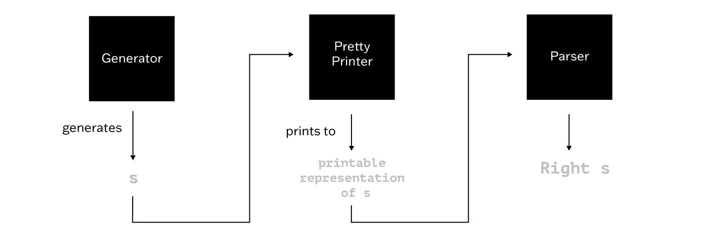
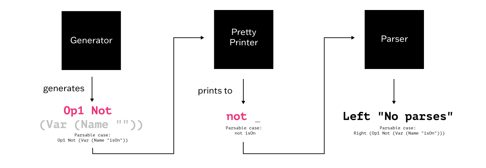
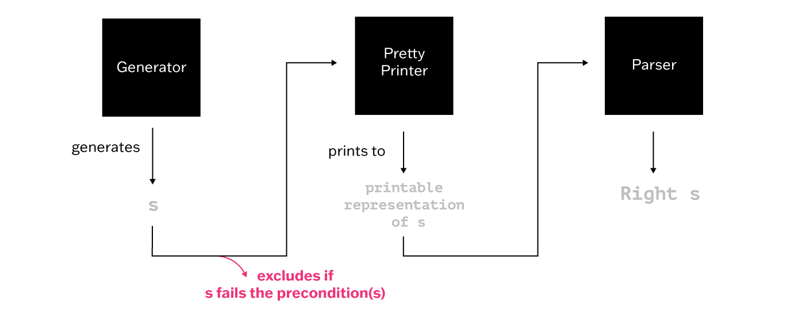
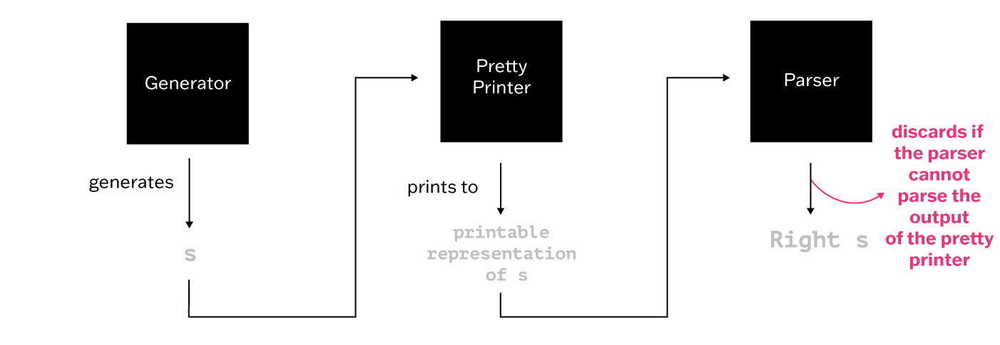
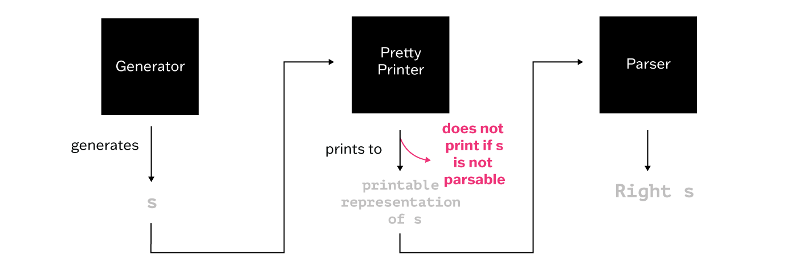

## Introduction
Property-based testing (PBT) is a powerful testing technique that balances the robustness of formal proofs and the efficiency of unit tests. PBT is done by leveraging three key components—namely, the program under test, the generator, and the properties. The generator produces inputs that are provided as arguments to the program, and we check if the outputs fulfill the properties we have identified. One type of property that proves particularly useful in PBT is round-trip properties. In this blog post, we will focus specifically on applying round-trip properties as we develop a parser and pretty printer for Lu. Lu is a programming language distilled from Lua, specifically designed for the Advanced Programming course at Penn (CIS 5520). Throughout the development process, we encountered interesting insights regarding round-trip properties in PBT.

## Background
One of the project’s motivations is to evaluate and showcase the support of Etna, an evaluation tool for PBT, for parsers and printers. Etna evaluates properties and generators by injecting bugs into the program and then examines how effectively a specific pair of generators and properties can detect and handle these bugs. Etna is organized by workloads, and each workload consists of bugs, properties, type definitions, and function implementations. By creating a parser and pretty printer workload, we demonstrate the tool's versatility in handling complex testing scenarios related to parsing and printing functionalities.

Developing this parser and pretty printer workload also aims to enrich the body of knowledge on PBT for parsers and printers. Through our experimentation with different generators and property expressions, we uncover insights that can aid developers in applying PBT effectively to similar projects.

## Round-trip Properties
The nature of the properties used for PBT can differ and largely depend on the program in question. A noteworthy type is the round-trip properties, which involve running a function on the inputs, then another to undo it, and verifying whether the resultant matches the initial inputs.

In the context of parsers and printers, round-trip properties verify that the printer can accurately convert a data structure into a printable representation and that, when parsed again, generates the same data structure. This guarantees consistency between the printing and parsing operations.

Here’s an example round-trip property written for the QuickCheck library in Haskell to verify the consistency of the parser and pretty printer. Statement `s`, a user-defined type representing a code statement, is passed as an argument to the pretty printer function (`pretty`). The result is then passed into the `parse` function. The property then checks if the parsed result matches the original statement (`Right s`).

```
prop_roundtrip_stat :: Statement -> Property
prop_roundtrip_stat s = parse (pretty s) == Right s
```




## Generators
Another crucial part of PBT is generators. They are responsible for providing inputs and allow us to explore a wide range of inputs to ensure comprehensive test coverage. Similar to properties, the generators we choose for different applications can vary greatly.

Generators can be simple and type-directed. For example, the generator for ASCII strings (from the Generic random library) picks a random ASCII character for a random number of times.

```
instance Arbitrary ASCIIString where
  arbitrary = ASCIIString `fmap` listOf arbitraryASCIIChar
```

However, generators can be more complex; for example, the generator of a string literal to test a Lu Parser has restrictions on escaping special characters.

```
instance Arbitrary StringLit where
	arbitrary = escape <$> listOf (arbitaryStringLitChars)
  		where
  		  -- escape special characters appearing in the string
   	 escape :: String -> String
   	 escape = foldr Char.showLitChar ""
```

## The Problem with Type-Directed Generators
With our exploration of generators and their potential impact on property testing in mind, let's delve back into our development process of the Lu parser and pretty printer.

During the initial stages of workload development, we constructed a parser in Haskell and employed the provided generator, pretty printer, and properties from the CIS 5520 course materials. Subsequently, we evaluated the program's correctness using PBT and the generator's effectiveness through Etna. As expected, everything performed well, and as many others have noticed, we saw that round-trip properties are very powerful, capable of detecting bugs with just a few trials (often less than 20).

Driven by the curiosity to explore alternative approaches, we experimented with simpler and type-directed generators, such as a derived generator implemented with the Generic random library, hypothesizing that more inputs might be needed to detect the bugs.

Surprisingly, when analyzing the Generic random generator, it seemingly detected bugs with significantly fewer inputs, often within just 1-2 iterations. To investigate further, we then tried running QuickCheck using the round-trip properties without injecting any mutants, and the properties failed to pass, even without injecting any mutants.

The problem was that the type-directed generator produced code that couldn’t be parsed. Unlike the generator we initially used, it lacked the necessary mechanisms to handle edge cases.  For example, the type-directed generator generated an empty string as the name of a variable that cannot be parsed.

The type-directed generator produced an internal representation of Lu code that reads `Op1 Not (Var (Name ""))`. This generated code attempts to reverse the value of a Boolean variable with an empty string as its name (`not `), which results in incorrect parsing. Such an occurrence does not arise when using our original generator, as it incorporates restrictions that prevent the generation of empty strings as variable names. Our findings show that some properties are not one-size-fits-all for all generators.




## Preconditions for Round-trip Properties
One way to address the issue we faced with incorrect code generation is to abandon type-directed generators. However, we felt that preserving the capability to use simple, derived generators is essential. Implementing restricting generators can be daunting and time-consuming, and the ability to automatically derive generators without extensive manual effort significantly enhances the efficiency of integrating PBT into the development workflow. Therefore, we shifted our focus from modifying the generators to tuning our round-trip properties.

Prior to our experiment with the Generic random generator, we assumed that no preconditions were necessary. However, the fact that there are edge cases that our generator has to be capable of handling showed us there is a need to add preconditions to round-trip properties and that they are no different from some other properties we used to test other workloads, such as BSTs.

When we write properties for BSTs, we add preconditions to ensure that our inputs comply with the BST invariants by filtering non-BST trees generated by a naive and simple generator. Similarly, we need to filter out the unparsable code generated by our type-directed generator for round-trip properties.

To construct the preconditions, we ran the property multiple times using a type-directed generator, allowing us to compile a list of edge cases the random generator fails to identify. These edge cases can then be used as preconditions.

In the sample property shown below, we added the precondition `statementIsParsable`, which encapsulates various syntax restrictions and the edge cases, in addition to the original round-trip property.

```
prop_roundtrip_stat :: Task Statement
prop_roundtrip_stat s = statementIsParsable s --> P.parse statementP (pretty s) == Right s
```




The relationship between property complexities and generators reveals a trade-off. Using type-directed generators broadens input diversity and, as a result, requires more informative properties, which is achieved by adding preconditions in this case.

## Discarding Unparsable Code and Total Printers
Another approach to filtering out unparsable code generated by the type-directed generator involves executing the property only on code that can be successfully parsed while discarding the rest. However, we soon realized this approach could lead to disastrous outcomes because the bugs we inject often produce unparsable code. Discarding these cases would hinder our ability to detect such bugs.

For example, if we inject a bug in the pretty printer, causing it to incorrectly print the negation operator as `nil` instead of `not`, the pretty printer would then produce code that the parser cannot parse. This outcome is expected and should be caught by the properties. However, if we discard all code that cannot be parsed, it will not catch this bug.

```
pp Not = PP.text "not" -- correct implementation
{-!! ppNot_1 -}
{-!
pp Not = PP.text "nil" -- injected bug
-}
```


As an alternative solution, we focused on the implementation of the pretty printer. Our testing cycle now follows this direction: generate, print, parse, and compare the result with the original input. Currently, we are using a total printer that prints regardless of whether the generated structure can be parsed. If we, instead, use a printer that catches non-parsable content, we will be able to determine whether a property not passing is a result of the generator producing unparsable content or due to a bug we injected.

Using the example in previous sections, say the type-directed generator produced an internal representation of Lu code that reads `Not (Var (Name ""))`, if the printer is designed to catch unparsable content, it would spot the empty variable name and discard this particular example.



## Conclusion
This experiment highlighted challenges encountered when employing PBT for parsers and printers. First, establishing the round-trip property proved to be more complex than anticipated, particularly when type-directed generators were utilized. The property has to be more informative due to the simplistic and type-directed nature of the generator. Second, difficulties arose in designing and articulating preconditions for the properties, even after recognizing their necessity. All in all, these challenges underscore the need for further research and innovative approaches in aligning properties and generators, ensuring more effective and accessible PBT in various applications.